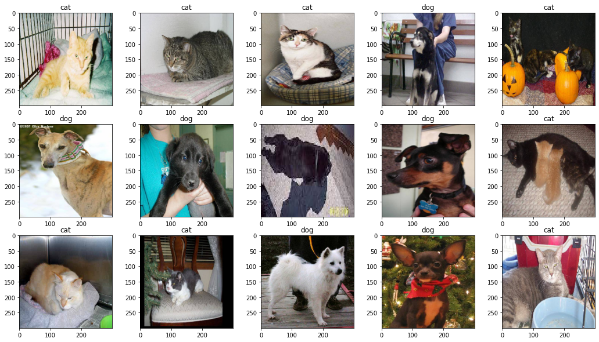
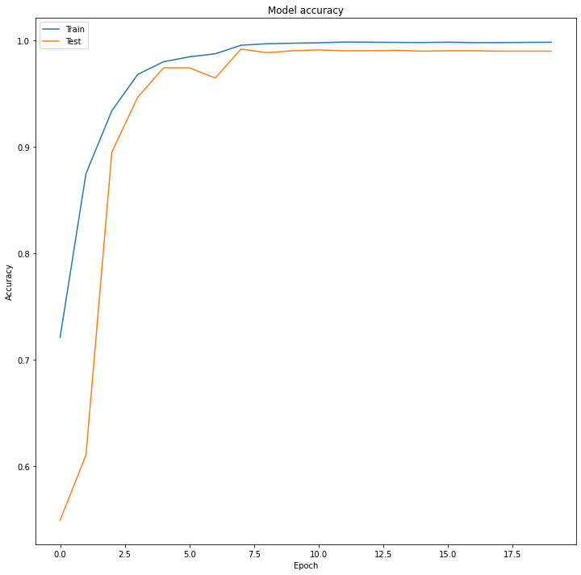
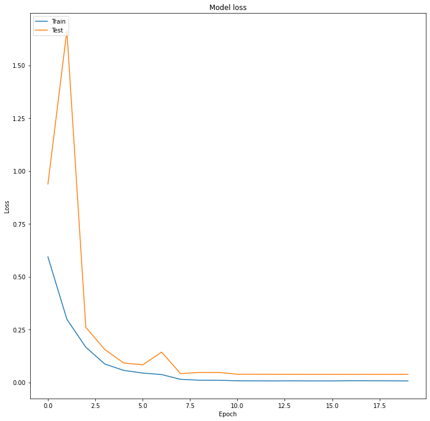
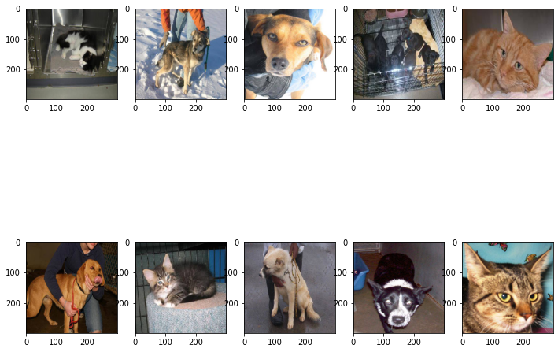
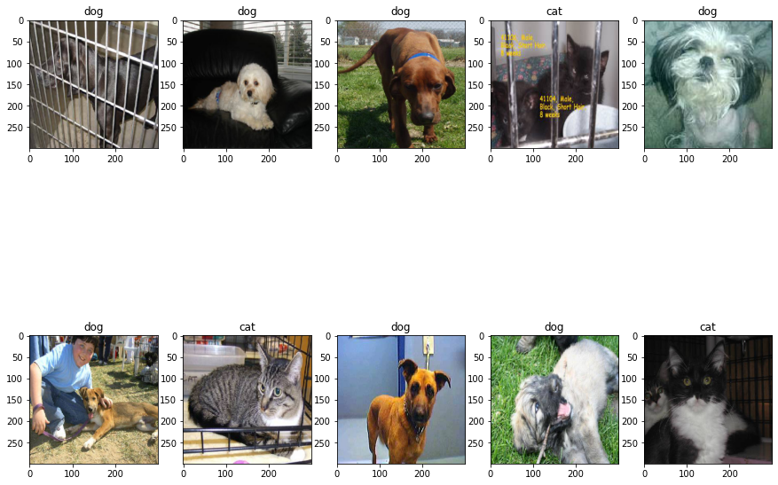
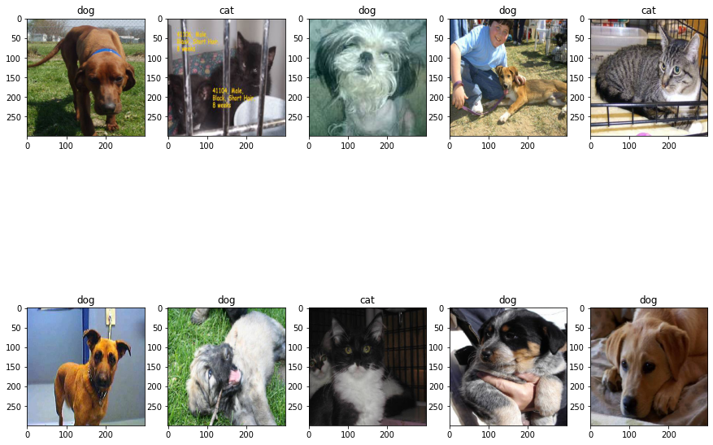
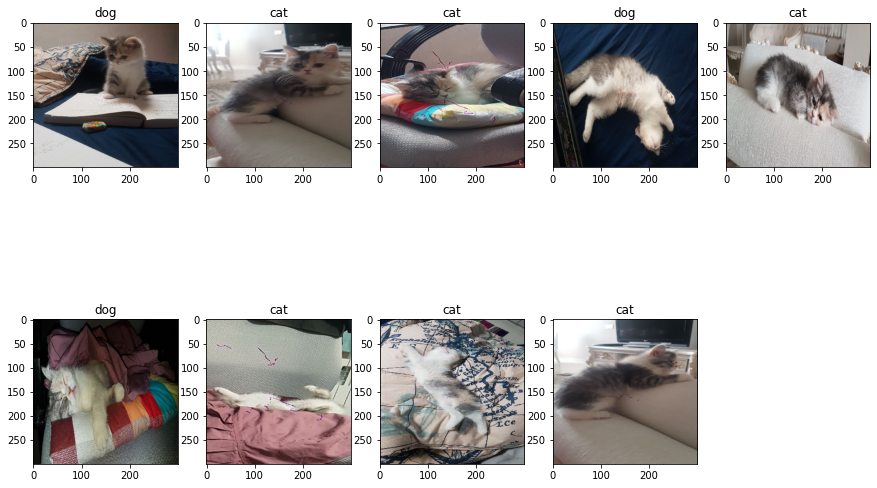
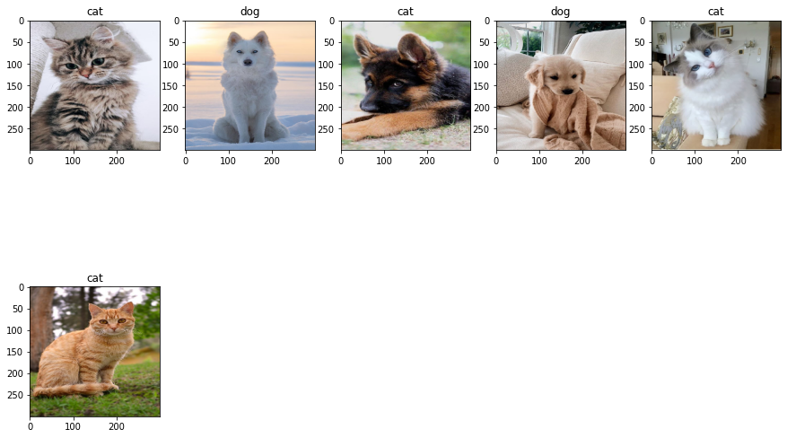

# Cat and Dog classification
##### In this notebook I will use CNN for this classification model and I will use two datasets from Kaggle.


So lets download the datasets


```
! mkdir ~/.kaggle
! cp kaggle.json ~/.kaggle/
! chmod 600 ~/.kaggle/kaggle.json
!kaggle datasets download -d biaiscience/dogs-vs-cats
```

    Downloading dogs-vs-cats.zip to /content
     99% 812M/817M [00:12<00:00, 55.0MB/s]
    100% 817M/817M [00:12<00:00, 69.2MB/s]


We have to unzip them !


```
import zipfile
with zipfile.ZipFile("dogs-vs-cats.zip", 'r') as zip_ref:
    zip_ref.extractall(".")
```


```
import numpy as np
import pandas as pd
from matplotlib import pyplot as plt
import seaborn as sns
import random
import tensorflow as tf
from tensorflow import keras
from tensorflow.keras.preprocessing.image import ImageDataGenerator
from keras.preprocessing.image import ImageDataGenerator, load_img
from keras.utils import to_categorical
from sklearn.model_selection import train_test_split
print(tf)
```

    <module 'tensorflow' from '/usr/local/lib/python3.6/dist-packages/tensorflow/__init__.py'>


So lets download the other dataset


```
! mkdir ~/.kaggle
! cp kaggle.json ~/.kaggle/
! chmod 600 ~/.kaggle/kaggle.json
!kaggle competitions download -c dogs-vs-cats
```

    mkdir: cannot create directory ‘/root/.kaggle’: File exists
    Warning: Looks like you're using an outdated API Version, please consider updating (server 1.5.6 / client 1.5.4)
    Downloading test1.zip to /content
     95% 257M/271M [00:03<00:00, 101MB/s] 
    100% 271M/271M [00:03<00:00, 91.1MB/s]
    Downloading train.zip to /content
     97% 528M/543M [00:06<00:00, 92.6MB/s]
    100% 543M/543M [00:06<00:00, 90.7MB/s]
    Downloading sampleSubmission.csv to /content
      0% 0.00/86.8k [00:00<?, ?B/s]
    100% 86.8k/86.8k [00:00<00:00, 77.5MB/s]


```
!mv train.zip train1.zip
!mkdir more_data
!mv train1.zip more_data
```


```
import zipfile
with zipfile.ZipFile("./more_data/train1.zip", 'r') as zip_ref:
    zip_ref.extractall("./more_data")
```

# Prepare Datasets

We have two dataset. So we should merge them and create an appropriate dataframe.


```
import os

training_dataset = []
labels = []

for x in os.listdir("./train/train/"):
    if x.startswith("dog"):
        labels.append("dog")
    else:    
        labels.append("cat")
    training_dataset.append("./train/train/" + x)

for x in os.listdir("./more_data/train/"):
    if x.startswith("dog"):
        labels.append("dog")
    else:    
        labels.append("cat")
    training_dataset.append("./more_data/train/" + x)

training_df = pd.DataFrame({
    'data': training_dataset,
    'labels': labels
})

train_df, validate_df = train_test_split(training_df, test_size=0.10, random_state=42)
train_df = train_df.reset_index(drop=True)
validate_df = validate_df.reset_index(drop=True)

training_df.head()
```


<div>
<style scoped>
    .dataframe tbody tr th:only-of-type {
        vertical-align: middle;
    }

    .dataframe tbody tr th {
        vertical-align: top;
    }

    .dataframe thead th {
        text-align: right;
    }
</style>
<table border="1" class="dataframe">
  <thead>
    <tr style="text-align: right;">
      <th></th>
      <th>data</th>
      <th>labels</th>
    </tr>
  </thead>
  <tbody>
    <tr>
      <th>0</th>
      <td>./train/train/cat.10303.jpg</td>
      <td>cat</td>
    </tr>
    <tr>
      <th>1</th>
      <td>./train/train/cat.2734.jpg</td>
      <td>cat</td>
    </tr>
    <tr>
      <th>2</th>
      <td>./train/train/cat.2599.jpg</td>
      <td>cat</td>
    </tr>
    <tr>
      <th>3</th>
      <td>./train/train/dog.3876.jpg</td>
      <td>dog</td>
    </tr>
    <tr>
      <th>4</th>
      <td>./train/train/dog.9595.jpg</td>
      <td>dog</td>
    </tr>
  </tbody>
</table>
</div>


We will use ImageDataGenerator from Tensorflow. The main reason is images have not same size and we should force them to have same size. This module will do this for us. 


```
train_datagen = ImageDataGenerator(rescale=1./255)
validation_datagen = ImageDataGenerator(rescale=1./255)

train_generator = train_datagen.flow_from_dataframe(
    train_df,
    x_col='data',
    y_col='labels',
    target_size=(300, 300),
    batch_size=128,
    class_mode="binary"
)

validate_generator = validation_datagen.flow_from_dataframe(
    validate_df,
    x_col='data',
    y_col='labels',
    target_size=(300, 300),
    batch_size=128,
    class_mode="binary"
)
```

    Found 45000 validated image filenames belonging to 2 classes.
    Found 5000 validated image filenames belonging to 2 classes.


# Check dataset

Now lets see some images randomly with their labels.


```
plt.figure(figsize=(18, 10))
for i in range(15):
    plt.subplot(3, 5, i + 1)
    rand = random.randrange(len(train_generator))
    second_rand = random.randrange(128)
    img = train_generator[rand][0][second_rand]
    label = train_generator[rand][1][second_rand]
    plt.title("cat" if int(label) == 0 else "dog")
    plt.imshow(img)
```





# Build the Model

And now this is time to create the CNN model!
We will use layers from keras.


```
from tensorflow.python.keras.models import Sequential
from tensorflow.python.keras.layers import Conv2D, MaxPooling2D, Dropout, Flatten, Dense, Activation, BatchNormalization

model = Sequential([
    Conv2D(32, (3, 3), activation='relu', input_shape=(300, 300, 3)),
    BatchNormalization(),
    MaxPooling2D(pool_size=(2, 2)),
    Dropout(0.25),

    Conv2D(64, (3, 3), activation='relu'),
    BatchNormalization(),
    MaxPooling2D(pool_size=(2, 2)),
    Dropout(0.25),

    Conv2D(128, (3, 3), activation='relu'),
    BatchNormalization(),
    MaxPooling2D(pool_size=(2, 2)),
    Dropout(0.25),

    Conv2D(256, (3, 3), activation='relu'),
    BatchNormalization(),
    MaxPooling2D(pool_size=(2, 2)),
    Dropout(0.25),
    
    Flatten(),
    Dense(512, activation='relu'),
    BatchNormalization(),
    Dropout(0.5),
    Dense(1, activation='sigmoid')
])

model.compile(loss='binary_crossentropy', optimizer='rmsprop', metrics=['mae', 'acc'])

model.summary()
```

    Model: "sequential"
    _________________________________________________________________
    Layer (type)                 Output Shape              Param #   
    =================================================================
    conv2d (Conv2D)              (None, 298, 298, 32)      896       
    _________________________________________________________________
    batch_normalization (BatchNo (None, 298, 298, 32)      128       
    _________________________________________________________________
    max_pooling2d (MaxPooling2D) (None, 149, 149, 32)      0         
    _________________________________________________________________
    dropout (Dropout)            (None, 149, 149, 32)      0         
    _________________________________________________________________
    conv2d_1 (Conv2D)            (None, 147, 147, 64)      18496     
    _________________________________________________________________
    batch_normalization_1 (Batch (None, 147, 147, 64)      256       
    _________________________________________________________________
    max_pooling2d_1 (MaxPooling2 (None, 73, 73, 64)        0         
    _________________________________________________________________
    dropout_1 (Dropout)          (None, 73, 73, 64)        0         
    _________________________________________________________________
    conv2d_2 (Conv2D)            (None, 71, 71, 128)       73856     
    _________________________________________________________________
    batch_normalization_2 (Batch (None, 71, 71, 128)       512       
    _________________________________________________________________
    max_pooling2d_2 (MaxPooling2 (None, 35, 35, 128)       0         
    _________________________________________________________________
    dropout_2 (Dropout)          (None, 35, 35, 128)       0         
    _________________________________________________________________
    conv2d_3 (Conv2D)            (None, 33, 33, 256)       295168    
    _________________________________________________________________
    batch_normalization_3 (Batch (None, 33, 33, 256)       1024      
    _________________________________________________________________
    max_pooling2d_3 (MaxPooling2 (None, 16, 16, 256)       0         
    _________________________________________________________________
    dropout_3 (Dropout)          (None, 16, 16, 256)       0         
    _________________________________________________________________
    flatten (Flatten)            (None, 65536)             0         
    _________________________________________________________________
    dense (Dense)                (None, 512)               33554944  
    _________________________________________________________________
    batch_normalization_4 (Batch (None, 512)               2048      
    _________________________________________________________________
    dropout_4 (Dropout)          (None, 512)               0         
    _________________________________________________________________
    dense_1 (Dense)              (None, 1)                 513       
    =================================================================
    Total params: 33,947,841
    Trainable params: 33,945,857
    Non-trainable params: 1,984
    _________________________________________________________________


```
from tensorflow.python.keras.callbacks import TerminateOnNaN, ProgbarLogger, History, EarlyStopping, ReduceLROnPlateau

earlystop = EarlyStopping(patience=10)
learning_rate_reduction = ReduceLROnPlateau(monitor='val_acc', patience=2, verbose=1,factor=0.2, in_lr=0.00001)
prob_logger = ProgbarLogger(count_mode='steps')
callbacks = [earlystop, learning_rate_reduction, TerminateOnNaN(), History()]
```

So just lets fit the model!


```
history = model.fit_generator(
    train_generator, 
    epochs=20,
    validation_data=validate_generator,
    validation_steps=len(validate_df) // 128,
    steps_per_epoch=len(train_df) // 128,
    callbacks=callbacks
)
```

    WARNING:tensorflow:From <ipython-input-32-9f852e21d391>:7: Model.fit_generator (from tensorflow.python.keras.engine.training) is deprecated and will be removed in a future version.
    Instructions for updating:
    Please use Model.fit, which supports generators.
    Epoch 1/20
    351/351 [==============================] - 203s 577ms/step - loss: 0.5942 - mae: 0.3319 - acc: 0.7212 - val_loss: 0.9385 - val_mae: 0.4269 - val_acc: 0.5495 - lr: 0.0010
    Epoch 2/20
    351/351 [==============================] - 203s 579ms/step - loss: 0.2989 - mae: 0.1812 - acc: 0.8748 - val_loss: 1.6638 - val_mae: 0.3863 - val_acc: 0.6108 - lr: 0.0010
    Epoch 3/20
    351/351 [==============================] - 202s 575ms/step - loss: 0.1666 - mae: 0.1005 - acc: 0.9339 - val_loss: 0.2605 - val_mae: 0.1676 - val_acc: 0.8950 - lr: 0.0010
    Epoch 4/20
    351/351 [==============================] - 203s 578ms/step - loss: 0.0872 - mae: 0.0534 - acc: 0.9679 - val_loss: 0.1557 - val_mae: 0.0688 - val_acc: 0.9465 - lr: 0.0010
    Epoch 5/20
    351/351 [==============================] - 200s 569ms/step - loss: 0.0569 - mae: 0.0337 - acc: 0.9799 - val_loss: 0.0920 - val_mae: 0.0375 - val_acc: 0.9742 - lr: 0.0010
    Epoch 6/20
    351/351 [==============================] - 201s 574ms/step - loss: 0.0442 - mae: 0.0256 - acc: 0.9844 - val_loss: 0.0830 - val_mae: 0.0401 - val_acc: 0.9742 - lr: 0.0010
    Epoch 7/20
    351/351 [==============================] - ETA: 0s - loss: 0.0371 - mae: 0.0210 - acc: 0.9873
    Epoch 00007: ReduceLROnPlateau reducing learning rate to 0.00020000000949949026.
    351/351 [==============================] - 198s 563ms/step - loss: 0.0371 - mae: 0.0210 - acc: 0.9873 - val_loss: 0.1435 - val_mae: 0.0442 - val_acc: 0.9645 - lr: 0.0010
    Epoch 8/20
    351/351 [==============================] - 197s 562ms/step - loss: 0.0146 - mae: 0.0092 - acc: 0.9954 - val_loss: 0.0417 - val_mae: 0.0115 - val_acc: 0.9918 - lr: 2.0000e-04
    Epoch 9/20
    351/351 [==============================] - 197s 563ms/step - loss: 0.0105 - mae: 0.0070 - acc: 0.9967 - val_loss: 0.0472 - val_mae: 0.0144 - val_acc: 0.9884 - lr: 2.0000e-04
    Epoch 10/20
    351/351 [==============================] - ETA: 0s - loss: 0.0099 - mae: 0.0064 - acc: 0.9973
    Epoch 00010: ReduceLROnPlateau reducing learning rate to 4.0000001899898055e-05.
    351/351 [==============================] - 200s 571ms/step - loss: 0.0099 - mae: 0.0064 - acc: 0.9973 - val_loss: 0.0474 - val_mae: 0.0123 - val_acc: 0.9902 - lr: 2.0000e-04
    Epoch 11/20
    351/351 [==============================] - 201s 574ms/step - loss: 0.0078 - mae: 0.0056 - acc: 0.9976 - val_loss: 0.0386 - val_mae: 0.0114 - val_acc: 0.9910 - lr: 4.0000e-05
    Epoch 12/20
    351/351 [==============================] - ETA: 0s - loss: 0.0073 - mae: 0.0053 - acc: 0.9984
    Epoch 00012: ReduceLROnPlateau reducing learning rate to 8.000000525498762e-06.
    351/351 [==============================] - 205s 583ms/step - loss: 0.0073 - mae: 0.0053 - acc: 0.9984 - val_loss: 0.0386 - val_mae: 0.0117 - val_acc: 0.9902 - lr: 4.0000e-05
    Epoch 13/20
    351/351 [==============================] - 201s 573ms/step - loss: 0.0071 - mae: 0.0052 - acc: 0.9982 - val_loss: 0.0384 - val_mae: 0.0118 - val_acc: 0.9902 - lr: 8.0000e-06
    Epoch 14/20
    351/351 [==============================] - ETA: 0s - loss: 0.0074 - mae: 0.0053 - acc: 0.9980
    Epoch 00014: ReduceLROnPlateau reducing learning rate to 1.6000001778593287e-06.
    351/351 [==============================] - 197s 562ms/step - loss: 0.0074 - mae: 0.0053 - acc: 0.9980 - val_loss: 0.0383 - val_mae: 0.0117 - val_acc: 0.9906 - lr: 8.0000e-06
    Epoch 15/20
    351/351 [==============================] - 198s 564ms/step - loss: 0.0071 - mae: 0.0052 - acc: 0.9979 - val_loss: 0.0381 - val_mae: 0.0118 - val_acc: 0.9898 - lr: 1.6000e-06
    Epoch 16/20
    351/351 [==============================] - ETA: 0s - loss: 0.0070 - mae: 0.0052 - acc: 0.9982
    Epoch 00016: ReduceLROnPlateau reducing learning rate to 3.200000264769187e-07.
    351/351 [==============================] - 201s 573ms/step - loss: 0.0070 - mae: 0.0052 - acc: 0.9982 - val_loss: 0.0382 - val_mae: 0.0117 - val_acc: 0.9902 - lr: 1.6000e-06
    Epoch 17/20
    351/351 [==============================] - 197s 561ms/step - loss: 0.0080 - mae: 0.0054 - acc: 0.9978 - val_loss: 0.0382 - val_mae: 0.0118 - val_acc: 0.9902 - lr: 3.2000e-07
    Epoch 18/20
    351/351 [==============================] - ETA: 0s - loss: 0.0078 - mae: 0.0055 - acc: 0.9978
    Epoch 00018: ReduceLROnPlateau reducing learning rate to 6.400000529538374e-08.
    351/351 [==============================] - 198s 564ms/step - loss: 0.0078 - mae: 0.0055 - acc: 0.9978 - val_loss: 0.0380 - val_mae: 0.0117 - val_acc: 0.9898 - lr: 3.2000e-07
    Epoch 19/20
    351/351 [==============================] - 200s 569ms/step - loss: 0.0075 - mae: 0.0055 - acc: 0.9980 - val_loss: 0.0380 - val_mae: 0.0118 - val_acc: 0.9898 - lr: 6.4000e-08
    Epoch 20/20
    351/351 [==============================] - ETA: 0s - loss: 0.0070 - mae: 0.0052 - acc: 0.9982
    Epoch 00020: ReduceLROnPlateau reducing learning rate to 1.2800001059076749e-08.
    351/351 [==============================] - 199s 567ms/step - loss: 0.0070 - mae: 0.0052 - acc: 0.9982 - val_loss: 0.0381 - val_mae: 0.0118 - val_acc: 0.9898 - lr: 6.4000e-08


```
plt.figure(figsize=(12, 12))

plt.plot(history.history['acc'])
plt.plot(history.history['val_acc'])
plt.title('Model accuracy')
plt.ylabel('Accuracy')
plt.xlabel('Epoch')
plt.legend(['Train', 'Test'], loc='upper left')
plt.show()

plt.figure(figsize=(12, 12))
plt.plot(history.history['loss'])
plt.plot(history.history['val_loss'])
plt.title('Model loss')
plt.ylabel('Loss')
plt.xlabel('Epoch')
plt.legend(['Train', 'Test'], loc='upper left')
plt.show()

plt.figure(figsize=(12, 12))
plt.plot(history.history['loss'])
plt.plot(history.history['val_loss'])
plt.title('Model loss')
plt.ylabel('Loss')
plt.xlabel('Epoch')
plt.legend(['Train', 'Test'], loc='upper left')
plt.show()
```








# Check the Model

And lets check some images and model performance


```
import zipfile
with zipfile.ZipFile("test1.zip", 'r') as zip_ref:
    zip_ref.extractall(".")
```


```
import os
cats = []
dogs = []
testing_dataset = []
labels = []
for x in os.listdir("./test1/"):
    testing_dataset.append("./test1/" + x)

for x in os.listdir("./test/test/"):
    testing_dataset.append("./test/test/" + x)

testing_df = pd.DataFrame({
    'data': testing_dataset
})


testing_df.head()
```


<div>
<style scoped>
    .dataframe tbody tr th:only-of-type {
        vertical-align: middle;
    }

    .dataframe tbody tr th {
        vertical-align: top;
    }

    .dataframe thead th {
        text-align: right;
    }
</style>
<table border="1" class="dataframe">
  <thead>
    <tr style="text-align: right;">
      <th></th>
      <th>data</th>
    </tr>
  </thead>
  <tbody>
    <tr>
      <th>0</th>
      <td>./test1/4684.jpg</td>
    </tr>
    <tr>
      <th>1</th>
      <td>./test1/622.jpg</td>
    </tr>
    <tr>
      <th>2</th>
      <td>./test1/2473.jpg</td>
    </tr>
    <tr>
      <th>3</th>
      <td>./test1/11177.jpg</td>
    </tr>
    <tr>
      <th>4</th>
      <td>./test1/8643.jpg</td>
    </tr>
  </tbody>
</table>
</div>


```
print(f'size of testing dataframe: {len(testing_df)}')
```

    size of testing dataframe: 25000


```
test_datagen = ImageDataGenerator(rescale=1./255)

test_generator = test_datagen.flow_from_dataframe(
    testing_df,
    x_col='data',
    target_size=(300, 300),
    batch_size=128,
    class_mode=None,
    shuffle=False
)
```

    Found 25000 validated image filenames.


```
print(test_generator[0].shape, test_generator[1].shape)
print(len(test_generator))
```

    (128, 300, 300, 3) (128, 300, 300, 3)
    196


```
plt.figure(figsize=(12, 10))
for i in range(10):
    plt.subplot(2, 5, i + 1)
    rand = random.randrange(len(test_generator))
    second_rand = random.randrange(128)
    img = test_generator[rand][second_rand]
    plt.imshow(img)
```





```
predict = model.predict_generator(test_generator, steps=np.ceil(len(testing_df)//128))
```


```
predict
```


    array([[7.0541501e-01],
           [5.4240007e-12],
           [5.8182685e-09],
           ...,
           [9.9987352e-01],
           [2.4271738e-03],
           [9.9381727e-01]], dtype=float32)


```
plt.figure(figsize=(15, 12))
for i in range(10):
    plt.subplot(2, 5, i + 1)
    img = test_generator[0][10*i]
    label = predict[10*i]
    plt.title("cat" if label <= 0.5 else "dog")
    plt.imshow(img)
```





So as we can see out model is working well


```
plt.figure(figsize=(15, 12))
for i in range(10):
    plt.subplot(2, 5, i + 1)
    img = test_generator[0][10*i + 20]
    label = predict[10*i + 20]
    plt.title("cat" if label <= 0.5 else "dog")
    plt.imshow(img)
```





Another well result from the model. 
The rest of the notebook are some tests too.


```
import zipfile
with zipfile.ZipFile("gandom.zip", 'r') as zip_ref:
    zip_ref.extractall(".")
```


```
import os
cats = []
dogs = []
gandom_dataset = []
labels = []
for x in os.listdir("./gandom/"):
    gandom_dataset.append("./gandom/" + x)

gandom_df = pd.DataFrame({
    'data': gandom_dataset
})


gandom_df.head()
```


<div>
<style scoped>
    .dataframe tbody tr th:only-of-type {
        vertical-align: middle;
    }

    .dataframe tbody tr th {
        vertical-align: top;
    }

    .dataframe thead th {
        text-align: right;
    }
</style>
<table border="1" class="dataframe">
  <thead>
    <tr style="text-align: right;">
      <th></th>
      <th>data</th>
    </tr>
  </thead>
  <tbody>
    <tr>
      <th>0</th>
      <td>./gandom/1399-01-09 03.00.33.jpg</td>
    </tr>
    <tr>
      <th>1</th>
      <td>./gandom/1399-01-09 03.00.43.jpg</td>
    </tr>
    <tr>
      <th>2</th>
      <td>./gandom/1399-01-09 03.00.22.jpg</td>
    </tr>
    <tr>
      <th>3</th>
      <td>./gandom/1399-01-09 03.00.26.jpg</td>
    </tr>
    <tr>
      <th>4</th>
      <td>./gandom/1399-01-09 03.00.46.jpg</td>
    </tr>
  </tbody>
</table>
</div>


```
gandom_datagen = ImageDataGenerator(rescale=1./255)

gandom_generator = gandom_datagen.flow_from_dataframe(
    gandom_df,
    x_col='data',
    target_size=(300, 300),
    batch_size=128,
    class_mode=None,
    shuffle=False
)
```

    Found 9 validated image filenames.


```
predict_gandom = model.predict(gandom_generator, steps=1)
```


```
predict_gandom
```


    array([[9.8645407e-01],
           [1.0920515e-06],
           [8.3785197e-03],
           [9.3453890e-01],
           [2.4634744e-05],
           [9.9558395e-01],
           [7.0035364e-03],
           [4.4452745e-02],
           [1.6912104e-03]], dtype=float32)


```
plt.figure(figsize=(15, 10))
for i in range(9):
    plt.subplot(2, 5, i + 1)
    img = gandom_generator[0][i]
    label = predict_gandom[i]
    plt.title("cat" if label <= 0.5 else "dog")
    plt.imshow(img)
```





```
import zipfile
with zipfile.ZipFile("pinterest.zip", 'r') as zip_ref:
    zip_ref.extractall(".")
```


```
import os

pinterest_dataset = []
labels = []
for x in os.listdir("./pinterest/"):
    pinterest_dataset.append("./pinterest/" + x)

pinterest_df = pd.DataFrame({
    'data': pinterest_dataset
})


pinterest_df.head()
```


<div>
<style scoped>
    .dataframe tbody tr th:only-of-type {
        vertical-align: middle;
    }

    .dataframe tbody tr th {
        vertical-align: top;
    }

    .dataframe thead th {
        text-align: right;
    }
</style>
<table border="1" class="dataframe">
  <thead>
    <tr style="text-align: right;">
      <th></th>
      <th>data</th>
    </tr>
  </thead>
  <tbody>
    <tr>
      <th>0</th>
      <td>./pinterest/14 Animalitos tiernos por si esta╠...</td>
    </tr>
    <tr>
      <th>1</th>
      <td>./pinterest/Yakutian Laika Dog Breed Informati...</td>
    </tr>
    <tr>
      <th>2</th>
      <td>./pinterest/german shepherd dog puppy puppies ...</td>
    </tr>
    <tr>
      <th>3</th>
      <td>./pinterest/This Is what Your Favorite Dog Bre...</td>
    </tr>
    <tr>
      <th>4</th>
      <td>./pinterest/PREMIUM REUSABLE LINT REMOVER + Fr...</td>
    </tr>
  </tbody>
</table>
</div>


```
pinterest_datagen = ImageDataGenerator(rescale=1./255)

pinterest_generator = pinterest_datagen.flow_from_dataframe(
    pinterest_df,
    x_col='data',
    target_size=(300, 300),
    batch_size=128,
    class_mode=None,
    shuffle=False
)
```

    Found 6 validated image filenames.


```
predict_pinterest = model.predict(pinterest_generator, steps=1)
```


```
predict_pinterest
```


    array([[1.5559733e-04],
           [9.9951100e-01],
           [6.9463369e-04],
           [9.9995458e-01],
           [2.8032373e-04],
           [1.5032408e-03]], dtype=float32)


```
plt.figure(figsize=(15, 10))
for i in range(6):
    plt.subplot(2, 5, i + 1)
    img = pinterest_generator[0][i]
    label = predict_pinterest[i]
    plt.title("cat" if label <= 0.5 else "dog")
    plt.imshow(img)
```




